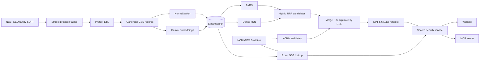

# GEOscope

> **See what GEO search misses.**

GEOscope is a hackathon prototype that makes [NCBI GEO](https://www.ncbi.nlm.nih.gov/geo/)
metadata easier to discover through hybrid semantic and keyword search,
ontology-aware normalization, and structured interfaces for both people and
LLM agents.

**[Try the live demo →](https://geoscope.kevinformatics.com)**

## Goal

Create better search for NCBI GEO by applying hybrid retrieval to its rich but
inconsistently described sample metadata.

GEO metadata is largely submitter-authored free text. The same biological
concept can appear under different names, abbreviations, protocols, platforms,
or characteristic keys, which makes literal search and reliable filtering
difficult. GEOscope combines semantic recall with keyword precision and
controlled metadata values so researchers can find relevant studies across
those vocabulary differences.

## Overview

We built an end-to-end system that acquires the public GEO corpus, removes bulk
expression tables while retaining series, platform, and sample metadata,
materializes one canonical document per GEO Series (GSE), normalizes useful
fields, builds embeddings, and loads everything into Elasticsearch.



The browser experience and MCP server use the same shared search layer. It
combines Elasticsearch retrieval with live NCBI candidates and LLM reranking,
so query handling, filters, facets, provenance, and final ordering remain
consistent across every consumer.

## What we accomplished

| Area | Result |
|---|---|
| Full-corpus acquisition | Catalogued 288,905 GSE accessions and materialized metadata for all 288,904 public records; the only residual accession was private/embargoed. |
| Canonical ETL | Built a resumable Prefect pipeline that preserves repeated series, platform, and sample attributes, aggregates sample metadata, and atomically publishes one canonical record per GSE. |
| Production embeddings | Built a complete **288,904 × 3,072** Gemini embedding artifact with stable GSE alignment and resumable Batch API state. |
| Search index | Loaded and audited **288,904 Elasticsearch documents with 288,904 Gemini vectors**. Stable GSE document IDs make full reloads idempotent. |
| Retrieval | Implemented exact accession lookup, weighted BM25, dense kNN, native reciprocal-rank fusion (RRF), normalized filters, disjunctive facets, unified NCBI candidate retrieval, and LLM reranking. |
| Metadata normalization | Grounded organisms to NCBITaxon IDs and sex to PATO IDs; extracted controlled assay categories and detailed labels from metadata prose. |
| Human interface | Built and deployed a responsive React/FastAPI comparison experience at [geoscope.kevinformatics.com](https://geoscope.kevinformatics.com). |
| Agent interface | Built a FastMCP service exposing exactly three read-only tools: `search_datasets`, `get_dataset`, and `facet_values`. |

At this checkpoint, the offline verification suite passes **391 Python tests**
(with nine opt-in live integrations skipped), and the frontend suite passes all
**seven tests**.

## Methods

### 1. Acquire metadata without retaining terabytes of expression data

We enumerated GEO Series through NCBI E-utilities, then streamed each family
SOFT file from NCBI's bulk FTP service. During the crawl, sample, platform, and
series-matrix data tables were removed while the complete metadata blocks were
preserved and validated. This reduced a potentially multi-terabyte raw crawl to
a manageable metadata corpus without discarding the fields needed for search.

The completed snapshot contains 288,904 public metadata files. The crawler is
bounded, retried, idempotent, and resumable; one individual source file exceeded
33 GB before being reduced to its metadata representation.

### 2. Build canonical, reproducible study documents

The Prefect flow inventories the stripped SOFT tree and parses only missing
outputs. It preserves the original attribute maps, aggregates distinct sample
values into each series document, produces the narrative text used for
retrieval, and publishes files atomically. Existing valid outputs are skipped
without reopening their source files, while deleting one output intentionally
rebuilds only that GSE.

### 3. Normalize metadata for reliable filters and facets

Embeddings help recover semantically related text, but they cannot provide
stable values for filtering or counting. We therefore keep raw metadata and a
separate normalization layer:

- organism names are mapped to **NCBITaxon** identifiers such as
  `NCBITaxon:9606`;
- sex values are mapped to **PATO** identifiers such as `PATO:0000383`; and
- assay evidence is converted into controlled categories and detailed labels
  such as `scRNA-seq`, `10x Chromium`, `ATAC-seq`, and `spatial transcriptomics`.

Normalization is value-driven and records `mapped`, `unmapped`, and `absent`
states instead of trusting noisy characteristic keys or silently guessing. For
example, contextual rules distinguish 10x Genomics assays from microscopy
magnification or chromium exposure.

### 4. Embed the metadata narrative

Each GSE embedding is composed from its title, study type, organism names,
summary, overall design, molecule names, sample sources, and sample
characteristics. Production uses `gemini-embedding-2` at 3,072 dimensions.
Batch request files, provider job state, results, aligned IDs, and artifact
metadata are retained so interrupted or incremental builds can resume without
silently repeating paid work.

### 5. Combine lexical, semantic, and live NCBI retrieval

Elasticsearch provides the shared online search layer:

- **BM25** searches accessions and weighted metadata fields, boosting titles
  and summaries for precise lexical matches.
- **Dense kNN** retrieves conceptually similar studies using the Gemini query
  and corpus vectors.
- **Hybrid search** combines both rankings with Elasticsearch's native RRF.
- **Filters and facets** operate on normalized organism, sex, and assay arrays.
  Values are ORed within a field and ANDed across fields; each facet omits its
  own active filter when counting alternatives.
- **Unified retrieval** concurrently gathers 40 Elasticsearch candidates and
  20 native NCBI GEO candidates, merges them by GSE accession, prefers the
  richer local metadata, and records whether each result came from
  Elasticsearch, NCBI, or both.
- **LLM reranking** uses GPT-5.6 Luna with low reasoning effort to select and
  order the final top 10 from the merged candidate set. Exact GSE accession
  lookups normalize the identifier, check the local index first, fall back to
  NCBI if needed, and bypass semantic retrieval and reranking so identifiers
  remain deterministic.

Elasticsearch remains the required source of indexed metadata. If live NCBI
retrieval or reranking is unavailable, the service falls back to deterministic
Elasticsearch order; it does not fail an otherwise valid search because an
optional enrichment step failed. The website renders the shared service's
ranked results directly, while an MCP client can use the same results to
produce a grounded explanation or continue a research conversation.

### Canonical production pipeline

The **Elasticsearch primary path** uses only
`gemini_embedding_2_3072_v1`, stored as `embedding_gemini_3072`. Its durable
handoffs are `data/processed/series_records`,
`data/processed/embedding_artifacts`, and
`data/processed/elasticsearch_load_report.json`. BGE, MedCPT, and Qwen remain
development/evaluation only.

Once the required environment and services are available, the complete
pipeline and its two local search surfaces reduce to:

```bash
uv run geo-soft-etl --allow-paid-gemini --gemini-max-cost-usd 9.55
uv run geo-search "human single-cell immune atlas" --mode hybrid --topk 10
uv run geo-web
```

## Experiments and findings

### Metadata-source comparison

We evaluated lightweight E-utilities summaries, GEOmetadb, and full family
SOFT. E-utilities summaries omit the per-sample characteristics needed for this
project. GEOmetadb enabled a fast 222,961-series baseline, but its snapshot did
not cover the latest corpus. Full family SOFT had the most complete metadata but
could contain enormous expression tables, so the deployed pipeline streams,
strips, validates, and retains only its metadata.

### Embedding bake-off

We built aligned frozen-corpus artifacts for several retrieval approaches rather
than selecting a model from a leaderboard alone:

| Model | Dimensions | Records | Role |
|---|---:|---:|---|
| BGE Small v1.5 | 384 | 249,736 | Fast local baseline |
| MedCPT | 768 | 249,736 | Biomedical query/document encoder experiment |
| Qwen3 Embedding 0.6B | 1,024 | 249,736 | Longer-context local experiment |
| Gemini Embedding 2 | 3,072 | 288,904 | Deployed production index |

The local artifacts exposed practical differences in build time and
truncation: BGE and MedCPT truncated substantially more long GEO records, while
the final Qwen configuration truncated 767 of 249,736. The deployed Gemini
pipeline preserves complete formatted inputs and fails visibly if a provider
rejects an oversized record.

We also built a repeatable seven-query live comparison that records BM25,
dense, and hybrid rankings plus filter and facet evidence for BGE, MedCPT, and
Qwen. This made retrieval behavior inspectable rather than treating “semantic
search” as a black box.

### Historical PostgreSQL baseline and Elasticsearch cutover

The first hybrid implementation used PostgreSQL, pgvector, and a BM25 extension.
We later moved the primary path to Elasticsearch so text analysis, vector
search, native RRF, filtering, and aggregation could live in one shared service.
Gemini's 3,072-dimensional vectors also exceed pgvector's 2,000-dimensional
`vector` limit. The PostgreSQL path remains as reproducible experiment history.

### Unified retrieval and LLM reranking

Hybrid Elasticsearch retrieval improved recall within the indexed snapshot,
but it could not surface a newly published or locally missing GSE. We therefore
extended the shared search service to retrieve a deeper Elasticsearch pool and
native NCBI GEO results concurrently, deduplicate them by accession, preserve
source provenance, and rerank the combined evidence with GPT-5.6 Luna at low
reasoning effort.

The service records timing, model usage, and reranking cost so relevance gains
can be evaluated against latency and spend. It also preserves deterministic
behavior: exact accessions take a direct lookup route, and natural-language
queries retain Elasticsearch ordering if an optional NCBI or LLM call fails.
Because this is implemented in the shared MCP/search layer, the website and MCP
clients receive the same final top 10 rather than maintaining separate ranking
logic.

### Ontology-normalization experiments

We prototyped deterministic normalization across nine candidate fields on the
222,961-series baseline. Among records that actually reported a value, the
simple rules and curated lookups reached **92% organism**, **93% sex**, and
**99% assay-label** coverage. Heavy-tailed free text reached much lower ceilings
— **50% disease**, **40% tissue**, and **12% cell type** — showing where lexical
ontology candidates, biomedical entity embeddings, or grounded LLM validation
would be necessary.

This experiment also established an important measurement rule: “not reported”
must be separated from “reported but unmapped.” Otherwise missing source
metadata is incorrectly counted as a normalization failure.

### Structured metadata extraction

We prototyped evidence-backed structured extraction from the canonical metadata
for biospecimens, biological conditions, interventions, genetic context,
demographics, assays, geography, technology, and study design. We compared
multiple OpenAI structured-output profiles on a selected pilot, then built a
lower-cost Gemini Flash-Lite Batch implementation and ran it over 10,000 GSEs.

All **15 Batch jobs succeeded**. The local evidence and schema validator
accepted **9,439 outputs** and preserved **561 failures** for diagnosis rather
than publishing partial claims.

The structured-extraction experiments cost **$121.61 in total**: **$47.52** for
the OpenAI structured-output pilot and **$74.10** for the 10,000-record Gemini
run, calculated from recorded token usage at the experiment's frozen rates.
The Gemini request manifest had estimated **$57.66** before the run, with a
conservative maximum of **$110.10**.

At the measured Gemini rate, extracting structured metadata for all **288,904**
public records would cost approximately **$2,141**; applying the same
conservative maximum gives a ceiling of approximately **$3,181**. That projected
full-corpus expense was too high for the hackathon, so structured extraction
remained an evaluated experiment rather than a production indexing stage. The
deployed index instead uses deterministic normalization plus embeddings;
LLM-extracted claims are not production facets. These accounting figures are
derived from local run reports and recorded usage rather than provider invoices,
and exclude embedding generation and search reranking.

## Current scope

- GEOscope indexes **series-level GSE metadata**, not expression matrices.
- Sample metadata is aggregated into each series. A filter therefore means the
  series contains each selected value somewhere; it does not prove one sample
  contains every selected value.
- Production normalization currently covers organism, sex, and assay. Tissue,
  disease, cell type, and ontology-hierarchy rollups remain experiments or
  future work.
- The current corpus is a completed public snapshot with resumable top-up
  tooling, not yet an automatically refreshed living index.
- Structured metadata extraction was evaluated but is not part of the deployed
  full-corpus search path.
