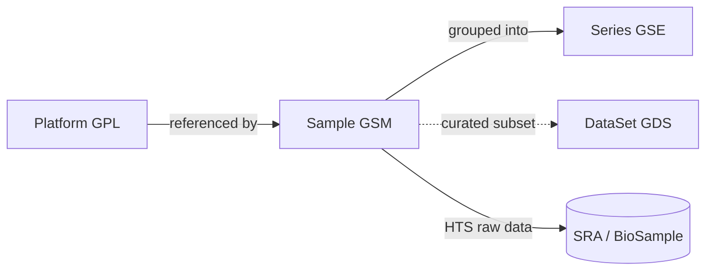

# 10 · GEO Data Model & Access

← [[Home]] · related: [[21-Ingestion-Pipeline]], [[11-The-Metadata-Problem]]

## Entities

GEO organizes everything into four record types ([overview](https://www.ncbi.nlm.nih.gov/geo/info/overview.html)):

| Type | ID | What it is | Source | Count (2026) |
|---|---|---|---|---|
| **Platform** | `GPLxxx` | An array or sequencer description | submitter | ~28,607 |
| **Sample** | `GSMxxx` | One sample: how it was handled + its measurements. References exactly **one** Platform; can appear in multiple Series | submitter | ~8,597,972 |
| **Series** | `GSExxx` | A **study**: groups related Samples, holds the narrative description | submitter | ~288,819 |
| **DataSet** | `GDSxxx` | A *curated* comparable collection of Samples | **NCBI curators** | ~4,348 |

Key facts:
- **GSE (Series) is our primary unit** for v1 — it's the "study" a user searches for, and there are a tractable ~289k of them. → [[40-Roadmap]]
- **GSE↔GSM is many-to-many, not one-to-one.** Every sample is submitted under a series (samples don't exist independently), but a sample can appear in *multiple* series — e.g. a reused control, or a sample present in both its original series and a **SuperSeries** that bundles several component GSEs. **SuperSeries nest** sub-series. Consequence for indexing: series-level rollups lose per-sample co-occurrence → [[24-Faceted-Search|the facet caveat]].
- **GDS is effectively frozen** (~4k, curation dormant for years). Don't build on it.
- The rich free text is author-supplied at GSE and GSM level → the [[11-The-Metadata-Problem|normalization problem]].

## Platforms (GPL) — the organism-cloning gotcha

A **Platform is the measurement instrument** shared across all samples/series that used it. Two flavors:
- **Array platforms** — a specific chip design *including the probe→gene mapping table* (e.g. "Affymetrix Human Genome U133 Plus 2.0"). The probe table is the substantive payload.
- **Sequencing platforms** — just the **instrument model** (e.g. "Illumina NovaSeq 6000"). No probe table.

> ⚠️ **GEO models every platform as organism-specific — even sequencers.** For arrays that's natural (a probe set is designed against one organism). But GEO applies the same *one-organism-per-platform* rule to organism-agnostic sequencers, so the same machine is **cloned once per organism**:
> - `GPL18573` = Illumina NextSeq 500 (**Homo sapiens**)
> - `GPL19057` = Illumina NextSeq 500 (**Mus musculus**) … and again for rat, zebrafish, etc.
>
> This is why "top GPLs" look like **instrument × species** combos, why one sequencer appears dozens of times, and why there are ~28.6k platforms — far more than real instrument models.

**Consequences for the index** (see [[24-Faceted-Search]]):
1. **Don't facet on raw GPL as "instrument/technology".** It double-encodes organism (already a facet via NCBITaxon) and fragments counts ("NovaSeq" scatters across NovaSeq-human, NovaSeq-mouse…). → normalize: **strip organism → bare `instrument_model`**; keep organism in its own facet.
2. **Platform ≠ assay.** A GPL gives the *machine*, not "10x 3′ scRNA-seq". Single-cell-ness + chemistry live in free text → normalized to EFO ([[22-Ontology-Normalization]]). The [[11-The-Metadata-Problem|"single cell RNA"]] problem is **not** solvable from GPL.
3. **Free coarse facet:** each GPL carries a **`technology`** attribute (`high-throughput sequencing`, `in situ oligonucleotide`, `oligonucleotide beads`, `spotted DNA/cDNA`, `RT-PCR`…) — a clean, low-cardinality "array vs sequencing vs …" facet with zero normalization.
4. **Cross-check via SRA:** for sequencing series, SRA's `instrument_model` (reachable via the [[21-Ingestion-Pipeline|elink/pysradb enrichment]]) is a cleaner, organism-free controlled instrument value than the parsed GPL title.

## Metadata formats

- **SOFT** (Simple Omnibus Format in Text) — line-based plain text. Line types: `^`=entity, `!`=attribute, `#`=column desc, plain=data. Variants: *full* (metadata+data tables) and *brief* (metadata only). The **family** file bundles a Series + its Samples + Platforms. ([soft.html](https://www.ncbi.nlm.nih.gov/geo/info/soft.html))
- **MINiML** — XML rendering of the same model (MIAME checklist). "GEO fully supports both." ([MINiML.html](https://www.ncbi.nlm.nih.gov/geo/info/MINiML.html))

### The fields that matter (SOFT `!` labels)

**Series (study-level free text — embed these):**
`!Series_title`, `!Series_summary`, `!Series_overall_design`, `!Series_pubmed_id`, `!Series_sample_id`

**Sample:**
`!Sample_title`, `!Sample_source_name_ch1`, **`!Sample_characteristics_ch1`** (semi-structured `key: value`, e.g. `tissue: liver`, `sex: M`), `!Sample_treatment_protocol_ch1`, `!Sample_extract_protocol_ch1`, `!Sample_molecule_ch1`, `!Sample_platform_id`

**Sequencing samples (mirrors SRA, not on the SOFT ref page but present in family files):**
`!Sample_library_strategy` (e.g. `RNA-Seq`), `!Sample_library_source` (`TRANSCRIPTOMIC`), `!Sample_library_selection` (`cDNA`, `PolyA`…)

> ⚠️ `!Sample_characteristics_ch1` is the goldmine and the mess: it's `key: value` but the keys and values are **submitter-invented and uncontrolled**. This is where `sex = M/F/0/1` lives. → [[22-Ontology-Normalization]]

## Access methods

### E-utilities (the `gds` Entrez DB) — for discovery & summaries
Base: `https://eutils.ncbi.nlm.nih.gov/entrez/eutils/`
- `esearch.fcgi?db=gds&term=…` → UIDs
- `esummary.fcgi?db=gds&id=…` → doc summaries (**supports `retmode=json`**)
- `efetch.fcgi?db=gds&id=…` → records
- `elink` → cross-DB links (e.g. to SRA/PubMed)
- **Rate limits:** 3 req/s without a key, **10 req/s with a free [API key](https://www.ncbi.nlm.nih.gov/account/)**. ([usage guide](https://www.ncbi.nlm.nih.gov/books/NBK25497/))

### FTP bulk — for the actual metadata payloads
Root: `ftp://ftp.ncbi.nlm.nih.gov/geo/`
- Series masked into "nnn" buckets: `…/geo/series/GSE1nnn/GSE1000/`
- Per-series subdirs: `matrix/`, `soft/`, `miniml/`, `suppl/`
- Family SOFT: `GSExxx_family.soft.gz`; Family MINiML: `GSExxx_family.xml.tgz`; Series matrix: `GSExxx_series_matrix.txt.gz` (its header block contains all the `!Series_*`/`!Sample_*` metadata — cheapest way to get metadata without the data tables)

### Libraries (don't parse SOFT by hand)
- **GEOparse** (`pip install GEOparse`) — parses SOFT into Python objects (GSE/GSM/GPL). Python analogue of R's GEOquery. [github](https://github.com/guma44/GEOparse)
- **pysradb** (`pip install pysradb`) — bridges **GSE/GSM ↔ SRP/SRX/SRR**; useful for pulling SRA `library_*` fields. [github](https://github.com/saketkc/pysradb)

### GEOmetadb — tempting but stale
A SQLite dump of parsed GEO metadata (gse/gsm/gpl/gds tables). **Last rebuilt ~2021-11-03** and widely reported outdated — use it to prototype schema ideas, **not** as a live source. ([Bioconductor](https://www.bioconductor.org/packages/release/bioc/html/GEOmetadb.html))

## Practical ingest recommendation

1. `esearch`/`esummary` (JSON) over `db=gds` to enumerate the GSE universe + light summaries (fast, indexable field extraction).
2. Pull **Series matrix header** or **family MINiML** from FTP for full metadata incl. per-sample characteristics.
3. For sequencing series, `elink`/`pysradb` to enrich with SRA `library_*` fields.
4. Parse with GEOparse; land raw records before normalizing.

Full pipeline in [[21-Ingestion-Pipeline]].

## Sources

- GEO overview (entities; curated vs submitter) — https://www.ncbi.nlm.nih.gov/geo/info/overview.html
- SOFT — https://www.ncbi.nlm.nih.gov/geo/info/soft.html · MINiML — https://www.ncbi.nlm.nih.gov/geo/info/MINiML.html
- Download / FTP layout — https://www.ncbi.nlm.nih.gov/geo/info/download.html · programmatic access — https://www.ncbi.nlm.nih.gov/geo/info/geo_paccess.html · HTS→SRA — https://www.ncbi.nlm.nih.gov/geo/info/seq.html
- Homepage counts — https://www.ncbi.nlm.nih.gov/geo/
- E-utilities — https://www.ncbi.nlm.nih.gov/books/NBK25501/ · rate limits — https://www.ncbi.nlm.nih.gov/books/NBK25497/ · JSON — https://www.ncbi.nlm.nih.gov/books/NBK25499/
- GEOparse — https://github.com/guma44/GEOparse · pysradb — https://github.com/saketkc/pysradb
- GEOmetadb (stale since 2021) — https://www.bioconductor.org/packages/release/bioc/html/GEOmetadb.html · https://support.bioconductor.org/p/9149627/
