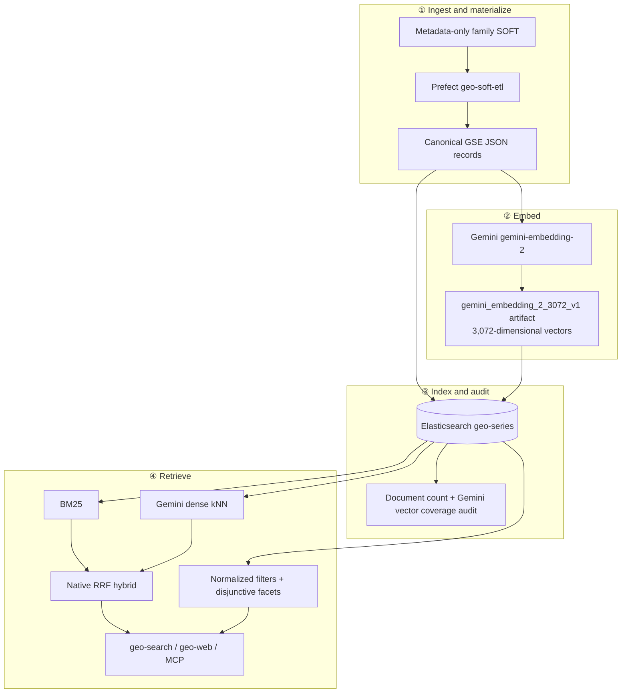

# 20 · Architecture Overview

← [[Home]]

## Current primary architecture

## Layer responsibilities

| Layer | Responsibility | Durable boundary |
|---|---|---|
| Prefect ingestion | Parse missing stripped SOFT records in bounded retryable batches | `data/processed/series_records/` |
| Gemini embedding | Build or resume the complete canonical Gemini matrix | `embedding_artifacts/gemini_embedding_2_3072_v1/` |
| Elasticsearch loading | Idempotently upsert stable GSE document IDs and audit coverage | `geo-series` index |
| Retrieval | Exact get, BM25, 3,072-dimensional dense kNN, native RRF, filters, and facets | `SearchResponse` |
| Clients | CLI, local comparison UI, and later MCP tools | Closed search/filter contract |

## Load-bearing decisions

1. **Elasticsearch is the primary online datastore.** It owns text analysis,
   BM25, 3,072-dimensional dense vectors, RRF, filters, and facets in one live
   service. [[51-Search-Database-Bakeoff-and-Elasticsearch-Plan]] records the
   selection.
2. **Gemini is the primary embedding model.** The fixed model key is
   `gemini_embedding_2_3072_v1`, backed by `gemini-embedding-2`, with vectors in
   `embedding_gemini_3072`. Its 3,072 dimensions exceed pgvector's 2,000
   dimension limit.
3. **The Prefect run is fail-closed.** Canonical materialization, Gemini
   artifact completion, Elasticsearch bulk upsert, and index audit must all
   complete before `geo-soft-etl` succeeds. Durable files remain resumable.
4. **Series-level GSE documents remain the v1 unit.** Sample metadata is folded
   into each canonical record; per-GSM indexing remains a later scale decision.
5. **PostgreSQL is historical comparison code.** `pg_hybrid.py` and its tests
   remain for reproducibility, but no primary CLI, web, or Prefect path imports
   or connects to it. See [[26-Datastore-Postgres]].

## Primary contracts

- Ingest → canonical GSE JSON with normalized organism, sex, and assay arrays.
- Embed → aligned `vectors.npy`, `ids.json`, and `metadata.json` for
  `gemini_embedding_2_3072_v1`.
- Index → stable GSE `_id`, source fields, normalized arrays, and
  `embedding_gemini_3072` in `geo-series`.
- Serve → `SearchResponse` with hits, scoped facets, and Elasticsearch
  provenance including mapping revision, active model, vector field, and
  dimensions.

Related details: [[21-Ingestion-Pipeline]], [[23-Search-and-Retrieval]],
[[24-Faceted-Search]], and [[27-MCP-Interface]].
