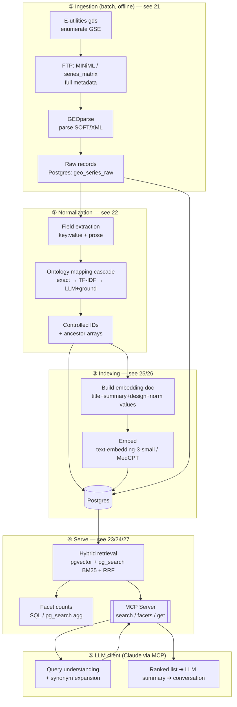

# 20 · Architecture Overview

← [[Home]]

## One picture

## The five layers

| # | Layer | Does | Note |
|---|---|---|---|
| ① | **Ingestion** | Pull + parse GEO into raw rows | Batch/idempotent, re-runnable. [[21-Ingestion-Pipeline]] |
| ② | **Normalization** | Free text → controlled ontology IDs | The hard, valuable part. [[22-Ontology-Normalization]] |
| ③ | **Indexing** | Build + embed docs, write to Postgres | Cost is trivial. [[25-Embeddings-and-Cost]] |
| ④ | **Serve** | Hybrid search, facets, get — behind MCP | One Postgres does it all. [[26-Datastore-Postgres]] |
| ⑤ | **Client** | LLM drives search, synthesizes answers | Not ours to build. [[27-MCP-Interface]] |

## The load-bearing decisions

1. **One Postgres for everything.** `pgvector` (dense) + `pg_search`/ParadeDB (BM25 + fast facets) + plain columns/arrays (filters + ontology facets). No separate Elasticsearch/vector-DB to sync. Matches your Postgres preference. Rationale & the alternatives considered: [[26-Datastore-Postgres]].
2. **Series-level (GSE) documents in v1.** ~289k docs, not 8.6M samples. Sample-level is a v2 scale step. [[40-Roadmap]]
3. **Retrieval is ours; generation is the LLM's.** We ship an MCP server; the client does expansion + summary + chat. [[27-MCP-Interface]]
4. **Normalization is a cheap-first cascade**, and it feeds *both* facets and the embedded text. [[22-Ontology-Normalization]]
5. **Everything measured against a small eval set** — embedding model, mapper, expansion are A/B'd, not guessed. [[25-Embeddings-and-Cost]]

## Data-flow contract (what each stage hands off)

- Ingest → `geo_series_raw(gse, raw_soft_json, samples_json, fetched_at)`
- Normalize → `geo_series_norm(gse, organism_id[], tissue_id[], assay_id[], disease_id[], sex_id[], ancestors[], real_values jsonb, confidence jsonb)`
- Index → `geo_series(gse, embedding vector, doc_tsv/bm25, <facet columns>, display_json)`
- Serve → MCP tools return `{results:[{gse, score, title, facets…}], facet_counts:{…}}`

Schema detail in [[26-Datastore-Postgres]].

## Sources

Synthesis note — external citations live in the layer notes it links: [[21-Ingestion-Pipeline]], [[22-Ontology-Normalization]], [[23-Search-and-Retrieval]], [[24-Faceted-Search]], [[26-Datastore-Postgres]] — and the full index [[99-Sources]].
