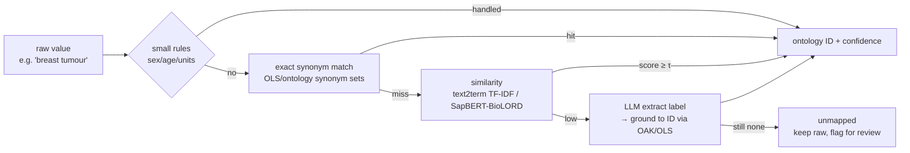

# 22 · Ontology Normalization

← [[Home]] · the heart of the project · pairs with [[24-Faceted-Search]]

> This is where `sex = M/F/0/1` becomes one thing, and where free-text tissue/disease/assay become facetable. It's **not** "just embeddings" — read [[#RAG vs. IDs|the framing]] below.

## The target: which ontology per field

The field→ontology mapping below is the **de-facto standard**, consistent across CELLxGENE, HCA, Sfaira, and MetaSRA (evidence in [[30-Prior-Art]]). Emulate CELLxGENE's schema — it's the strictest and best-documented.

| Field | Ontology | Prefix / IRI example | Notes |
|---|---|---|---|
| Organism | **NCBITaxon** | `NCBITaxon:9606` (human), `10090` (mouse) | Easiest; near-deterministic |
| Tissue / anatomy | **UBERON** | `UBERON:0002107` (liver) | Cross-species |
| Cell type | **Cell Ontology (CL)** | `CL:0000236` (B cell) | DAG (multiple parents) |
| Disease | **MONDO** | `MONDO:0007254` (breast cancer); `PATO:0000461` = "normal" | MONDO harmonizes DOID/OMIM/Orphanet/NCIT |
| Assay / method | **EFO** (⊇ OBI) | `EFO:...` (child of `EFO:0002772`/`EFO:0010183`) | Where 10x 3′/5′/Drop-seq/SPLiT-seq live |
| Sex | **PATO** | `PATO:0000384` (male), `PATO:0000383` (female), `PATO:0001340` (hermaphrodite) | CELLxGENE convention |
| Ethnicity / ancestry | **HANCESTRO** | `HANCESTRO:0005` (European) | human only |
| Developmental stage | **HsapDv / MmusDv** | `HsapDv:…` / `MmusDv:…` | species-specific |
| Cell line | **Cellosaurus** | `CVCL_…` | if samples are cell lines |

**EFO is the hub.** It's an EBI application ontology (~93k terms) that *imports* UBERON, CL, ChEBI, and MONDO, purpose-built to annotate expression experiments — so one ontology covers most fields. Note EFO uses the EBI IRI base `http://www.ebi.ac.uk/efo/EFO_…`, **not** the OBO PURL. ([EFO](https://www.ebi.ac.uk/efo/))

> ⚠️ **Sex has two conventions.** Single-cell world (CELLxGENE) uses **PATO** (`0000383`/`0000384`). GA4GH/clinical (Phenopackets) uses **NCIT** (`C46112`/`C46113`). Pick PATO to match the expression-data ecosystem; keep NCIT as an xref. (Aside: the `NCIT:C46109/C46110` pair sometimes cited for sex is *wrong* — the phenopacket codes are C46112/C46113.)

## The mapping cascade (cheap-first)

The literature is unanimous on the shape: **exact/curated lookup → similarity → LLM only for the residual, always grounded to a real ID.** Never let an LLM emit ontology IDs freely (it hallucinates them — GO grounding was **3/100 correct** direct vs **98/100** when grounded via a lookup step; [SPIRES](https://pmc.ncbi.nlm.nih.gov/articles/PMC10924283/)).

### Tiers, with tools

1. **Hand rules for the trivial-but-messy fields.** `sex`, `age`, units. A small dictionary collapses `M/male/XY → PATO:0000384`. Highest precision, zero dependencies. (MetaSRA does exactly this + a "maximal phrase" rule so *"breast"* isn't wrongly pulled out of *"breast cancer"*.) **Two data-driven refinements the spike proved necessary (see [[#Spike results (v1, measured)]]):**
   - **Value-driven, with an explicit reject path — not key-driven.** The `sex:` key is polluted with strain (`sex: C57BL/6`), age (`sex: 68M`), stage (`sex: adult`), and bare numeric codes (`sex: 0/1/2…`). You must validate each *value* against the sex value-space and send the rest to `unmapped` with a reason; never trust the key alone.
   - **Do not map bare numbers.** The optimistic `1 → male` rule is unsafe: the observed numeric range runs to 13 (leaked counts / per-study codebooks with no fixed polarity), so a number is `numeric_code → unmapped`, never a guessed sex. Also merge both the `sex` and `gender` keys into this field.
2. **Exact synonym lookup** against ontology label+synonym sets. Pull terms via **OLS4** (`https://www.ebi.ac.uk/ols4/api/search?q=…&ontology=efo&exact=true`) or load OWL locally with **OAK** (`oaklib`). Deterministic, can't hallucinate an ID.
3. **Lexical/semantic similarity** for variants/misspellings:
   - **text2term** (`pip install text2term`) — default **TF-IDF** mapper is fast (<1 min for 10k terms) and, in its own UK-Biobank→EFO benchmark, **most accurate (73.3%)** *and* fastest (4s) vs Zooma (65%, 687s) / Levenshtein / BioPortal. ([Database 2024](https://academic.oup.com/database/article/doi/10.1093/database/baae119/7912353))
   - **SapBERT / BioLORD-2023** embeddings for entity linking when strings diverge semantically ("mammary carcinoma" ↔ "breast cancer"). SapBERT is UMLS-synonym-tuned; BioLORD adds definition/sentence grounding. Nearest-neighbor over term-label embeddings → every candidate is a **real** ontology term (no hallucination). ([SapBERT](https://github.com/cambridgeltl/sapbert), [BioLORD](https://huggingface.co/FremyCompany/BioLORD-2023))
   - **Zooma** (EBI) — precedent-first: reuses prior curated annotations, falls back to OLS; returns HIGH/GOOD/MEDIUM confidence you can route on. Great as a *second opinion* / cross-check.
4. **LLM extraction for the messy residual** — long prose where the value is buried (e.g. teasing "10x 5′" out of an extract protocol). Use the LLM to propose a **label/span**, then **ground** it to an ID with OAK/OLS. Pattern: [OntoGPT/SPIRES](https://github.com/monarch-initiative/ontogpt). Highest coverage, highest cost/latency, so it's last.

Route by **confidence**: tier 1–2 auto-accept; tier 3 accept above a threshold `τ`; tier 4 / low-confidence → `unmapped`, keep raw, flag. Store per-field confidence so facets can distinguish "known female" from "guessed".

## RAG vs. IDs — answering "isn't this just embeddings?"

| | Embeddings/RAG | Ontology IDs |
|---|---|---|
| Good for | fuzzy **recall** in search | discrete **facets**, filters, counts, roll-ups |
| Can you `GROUP BY` it? | No | Yes |
| Hallucination risk | n/a (retrieval) | none if grounded via lookup |
| Handles new phrasings | yes, natively | only via the cascade |

**You need both, and they compound:** normalized values (`assay: 10x 3′ scRNA-seq`, `organism: Homo sapiens`) get **written back into the text you embed** — so retrieval gets a cleaner, richer signal, *and* you get clean facets. Normalization is not replaced by embeddings; it's upstream of them.

## Ontology-hierarchy note (for facets)

CL and EFO are **DAGs** (a term has multiple parents). To support "pick T cell → get all subtypes", precompute a **multi-valued transitive-ancestor array** per record (the `is_a`/`subClassOf` closure). This is what makes hierarchical facets a plain `terms` aggregation. Mechanics in [[24-Faceted-Search]].

## Spike results (v1, measured)

**Status: tier-1/2 built for all nine fields** in `src/geo_index/normalize.py` (`geo-normalize migrate|run|report|demo`). Run over the 222,961 loaded series, writing `<field>_ids[]` + `<field>_status` (and `assay_categories[]`/`assay_labels[]`, `age_norm[]`) back to the `series` table. Curated ID tables are a **prototype head, sample-verified against OLS4/Cellosaurus** — tier-2 OLS/OAK lookup should replace the hardcoding (see finding 2).

Coverage below is **of *reported* values** — `mapped ÷ (mapped + unmapped + unknown)`, i.e. excluding `absent`. That denominator is the whole point of finding 1.

| Field | Ontology | mapped | unmapped | absent | **cov. of reported** |
|---|---|--:|--:|--:|--:|
| organism | NCBITaxon | 201,174 | 17,508 | 4,279 | **92%** |
| sex | PATO | 41,503 | 1,602 | 178,552 | **93%** |
| ethnicity | HANCESTRO | 1,239 | 155 | 221,538 | **89%** |
| assay | (labels; EFO defer) | 221,318 | — | 1,643 | **99%** |
| disease | MONDO (+PATO normal) | 5,750 | 5,719 | 211,256 | **50%** |
| tissue | UBERON | 34,566 | 52,812 | 135,456 | **40%** |
| dev_stage | (coarse labels) | 4,927 | 9,504 | 208,343 | **34%** |
| cell_line | Cellosaurus | 12,024 | 30,060 | 180,554 | **29%** |
| cell_type | Cell Ontology | 8,371 | 60,223 | 154,228 | **12%** |

**Four findings:**

1. **Separate `absent` from `unmapped` or coverage lies.** Sex looks like a 19%-of-all-series win, but 80% of series simply *don't report sex*; of those that do, we map 93%. Report the two buckets separately — a low all-series rate is mostly missing source data, not a broken mapper. Stored as a per-field `*_status` column so facets show "known female" vs "not reported".
2. **The tier-1/2 → tier-3 boundary is now quantified per field — this is the key result.** Two clean regimes:
   - **Near-closed vocabularies — tier-1/2 exact lookup suffices (≥89%):** `organism`, `sex`, `ethnicity`, `assay`. A curated head + hand rules is the right, cheap tool; stop here for v1.
   - **Heavy-tailed free text — tier-1/2 hits a hard ceiling, tier-3 is mandatory:** `cell_type` (12%), `cell_line` (29%), `dev_stage` (34%), `tissue` (40%), `disease` (50%). These have tens of thousands of distinct values; hand-curation can't win the tail — this is exactly where **text2term (TF-IDF) / SapBERT** earn their place, and the disease/tissue numbers are inflated by easy anchors (`normal`→PATO; `liver`/`blood`). **(v2)**
3. **Value-driven rejection works and is auditable across fields.** Mappers reject the wrong concept in the right slot rather than emitting a wrong ID: `sex: C57BL/6`→`leaked_strain`, `dev_stage: IV`/`1a`→`tumor_stage`, `tissue: breast cancer`/`PBMC`→miss, generic `disease: cancer` and ambiguous 2-letter abbrevs (`ad`/`uc`/`cd`)→miss. Every non-mapping carries a reason.
4. **Fine assay extraction from free text is a real win** — 48,119 series get a specific assay label mined from title/summary/design that is **absent from GEO's coarse `type` enum**: ChIP-seq 23,927 · scRNA-seq 10,877 · ATAC-seq 5,946 · 10x Chromium 3,527 · bisulfite-seq 3,107 · Hi-C 1,791 · snRNA-seq 1,513 · CUT&RUN, CUT&Tag, spatial, Ribo-seq, CLIP-seq. EFO grounding of these labels is the deferred step.

**Facets compose.** Normalized IDs turn into cross-field aggregations via array containment + `GROUP BY` — e.g. tissues among *human* (`NCBITaxon:9606`) *scRNA-seq* (`assay_labels @> {scRNA-seq}`) studies returns blood › bone marrow › lung › skin › liver › brain, a sensible single-cell distribution. This is the RAG-vs-IDs payoff made concrete → [[24-Faceted-Search]].

## Spike scope

Original plan: prove the cascade on 3 fields. **Outcome: tier-1/2 built for all 9** — which turned the "which is the hard third field?" question into a measured answer. For the **tier-3 spike, start with `tissue` (UBERON)**: highest-volume heavy-tailed field, a labeled key (unlike fine assay, which isn't in `type` and needs tier-4 extraction — already partly solved via keyword labels in finding 4). The approved next step is a pinned UBERON/PO catalog, deterministic exact + lexical candidates, per-value evidence, bounded LLM validation, and a 100–200-value review set. Semantic term embeddings and species-specific vocabularies are decision-gated on the lexical eval rather than assumed up front. → [[43-Tissue-Candidate-Generation-Plan]], [[25-Embeddings-and-Cost#Eval]], [[40-Roadmap]]

## Sources

- **Field→ontology schema:** CELLxGENE — https://github.com/chanzuckerberg/single-cell-curation/blob/main/schema/4.0.0/schema.md · latest — https://chanzuckerberg.github.io/single-cell-curation/latest-schema.html
- **Ontologies:** EFO — https://www.ebi.ac.uk/efo/ · NCBITaxon — https://obofoundry.org/ontology/ncbitaxon.html · UBERON — https://obofoundry.org/ontology/uberon.html · CL — https://obofoundry.org/ontology/cl.html · MONDO — https://obofoundry.org/ontology/mondo.html · DOID — https://obofoundry.org/ontology/doid.html · OBI — https://obofoundry.org/ontology/obi.html · PATO — https://obofoundry.org/ontology/pato.html · HANCESTRO — https://obofoundry.org/ontology/hancestro.html · HsapDv/MmusDv — https://obofoundry.org/ontology/hsapdv.html
- **Sex codes (PATO vs NCIT):** phenopacket schema — https://github.com/phenopackets/phenopacket-schema/blob/master/docs/sex.rst
- **Mapping tools:** OLS4 — https://www.ebi.ac.uk/ols4/ · Zooma — https://www.ebi.ac.uk/spot/zooma/ · text2term (+ TF-IDF benchmark) — https://github.com/ccb-hms/ontology-mapper · https://academic.oup.com/database/article/doi/10.1093/database/baae119/7912353 · OntoGPT/SPIRES — https://github.com/monarch-initiative/ontogpt · OAK — https://github.com/INCATools/ontology-access-kit
- **Methods / tradeoffs:** MetaSRA — https://academic.oup.com/bioinformatics/article/33/18/2914/3848915 · SapBERT — https://aclanthology.org/2021.naacl-main.334/ · BioLORD-2023 — https://huggingface.co/FremyCompany/BioLORD-2023 · LLM ID-grounding / hallucination — https://pmc.ncbi.nlm.nih.gov/articles/PMC10924283/ · https://arxiv.org/pdf/2503.21813
