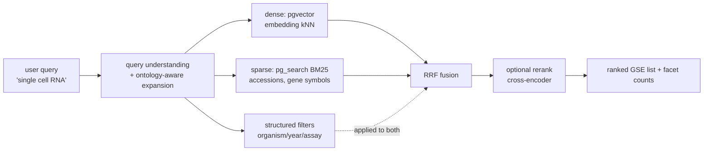

# 23 · Search & Retrieval

← [[Home]] · pairs with [[24-Faceted-Search]], [[27-MCP-Interface]]

## Pipeline

## 1. Query understanding & expansion — *this is the "single cell RNA" fix*

Two layers, both ideally done by the **LLM client over MCP** (see [[27-MCP-Interface]]), with a deterministic fallback in the service:

- **Synonym / assay expansion.** "single cell RNA" → `{scRNA-seq, 10x 3′, 10x 5′, Chromium, Drop-seq, Smart-seq2, SPLiT-seq, sci-RNA-seq, CEL-seq2, droplet-based}`. **Ground the expansion in EFO/OBI**, don't trust free LLM generation — ontology-grounded expansion both lifts recall and cuts hallucinated drift (BMQExpander reports +6.5% NDCG@10 over the best baseline and +15.7% robustness by grounding LLM expansion in the ontology; [arXiv 2508.11784](https://arxiv.org/abs/2508.11784)).
- **Multi-query** (optional): 3–5 paraphrases, each retrieved, results fused with RRF. Raises recall on terminology-diverse corpora — exactly ours.

> Because the assay concept is *also* a normalized facet ([[22-Ontology-Normalization]]), expansion can be **structural** too: "single cell RNA" → filter `assay ∈ descendants(EFO single-cell RNA sequencing)`. Semantic + structural expansion together is the strong play.

## 2. Hybrid retrieval (dense + sparse)

- **Dense** (`pgvector`): semantics/paraphrase — the core recall driver for the synonym problem.
- **Sparse/BM25** (`pg_search`): exact tokens embeddings fumble — **accessions (`GSE12345`), gene symbols, platform IDs (`GPL24676`), assay abbreviations**.
- **Fuse with RRF** (`score = Σ 1/(k+rank)`, k≈60): rank-based, needs no score normalization between the two lists — the standard, and easy in SQL. → [[26-Datastore-Postgres#Hybrid query]]

> ⚠️ **Hybrid is not automatically better.** Recent benchmarks: with a strong embedding model, adding BM25 can *hurt*; with weaker models it helps a lot (RRF hybrid ~+38% MAP@10 over BM25 alone in one benchmark). **Decision: BM25 stays for exact-ID matching regardless, but whether to fuse-vs-route is an [[25-Embeddings-and-Cost#Eval|eval]] question.**

## 3. Filtering

Structured filters (organism, assay, tissue, year, sample_count, hierarchy ancestors) apply *alongside* the vector query. pgvector 0.8's **iterative index scans** fixed the old "over-filtering returns too few rows" problem — set `hnsw.iterative_scan = relaxed_order`. → [[26-Datastore-Postgres]]

## 4. Reranking (optional, high ROI)

Two-stage retrieve-then-rerank: get top-50–100 cheaply, then a **cross-encoder** re-sorts to top-10 (adds ~50–200 ms, often the single biggest quality win).
- **Where it lives:** for the spike, **skip it in the service** — the MCP client's LLM can rerank/select from a top-50 list, or you add it later.
- **If self-hosting:** `bge-reranker-v2-m3` or `mxbai-rerank-v2` / `Qwen3-Reranker` (Apache-2.0). **Managed:** Cohere Rerank. **Domain-native:** the **MedCPT Cross-Encoder** (NCBI, trained on PubMed) pairs naturally if you use MedCPT embeddings. → [[25-Embeddings-and-Cost]]

## 5. Output

The service returns a **ranked list of GSE records** + facet counts. That's the faithful, inspectable, low-hallucination deliverable for *discovery*. Summaries/answers are layered by the LLM client — see [[27-MCP-Interface]] for why that split is right.

## What we build vs. what the LLM does

| Step | Owner |
|---|---|
| Synonym/ontology expansion | LLM client (primary) + service fallback |
| Dense + sparse retrieval, fusion | **Service** |
| Filtering + facet counts | **Service** |
| Reranking | Service (later) *or* LLM |
| Summary / conversation | **LLM client** |

## Sources

- Ontology-grounded query expansion (BMQExpander) — https://arxiv.org/abs/2508.11784
- LLM query understanding for live RAG — https://arxiv.org/pdf/2506.21384
- RRF hybrid dense+sparse — https://ceur-ws.org/Vol-4173/T3-7.pdf
- MedCPT retriever + cross-encoder (NCBI) — https://academic.oup.com/bioinformatics/article/39/11/btad651/7335842
- Reranker options (2026) — https://futureagi.com/blog/best-rerankers-for-rag-2026/
- Ranked list vs generated summary (coverage) — https://arxiv.org/pdf/2603.08819
