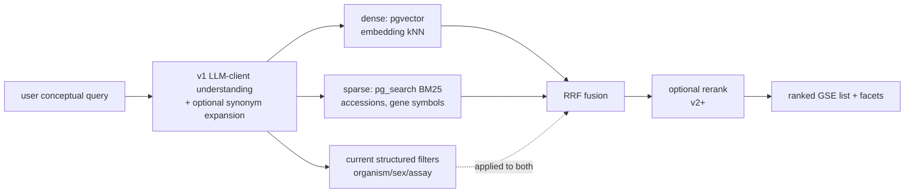

# 23 · Search & Retrieval

← [[Home]] · pairs with [[24-Faceted-Search]], [[27-MCP-Interface]]

## Pipeline

## 1. Query understanding & expansion

For **(v1)**, the LLM client over MCP is the only expansion layer; the server
accepts the resulting free-text query and closed filters. This keeps Track 4
deterministic and model-free. “Single cell RNA” remains one eval case, but the
measured value proposition is broader conceptual/cross-vocabulary discovery
([[42-Build-Log#What semantic search did prove valuable for]]).

- **Client synonym expansion (optional):** the client can map a concept to
  assay labels returned by `facet_values` and/or enrich the free-text query.
- **Client multi-query (optional):** the client may issue paraphrases and combine
  returned accessions; the service exposes no multi-query endpoint in v1.

Deterministic ontology-grounded expansion and hierarchy traversal are **(v2+)**.
They remain promising—ontology-grounded expansion has published retrieval
evidence ([BMQExpander](https://arxiv.org/abs/2508.11784))—but depend on a
stable ontology mapper and are not Track 4 behavior.

## 2. Hybrid retrieval (dense + sparse)

- **Dense** ([`pgvector`](https://github.com/pgvector/pgvector)): semantics and
  paraphrase.
- **Sparse/BM25** (`pg_search`): exact tokens embeddings fumble — **accessions (`GSE12345`), gene symbols, platform IDs (`GPL24676`), assay abbreviations**.
- **Fuse with RRF** (`score = Σ 1/(k+rank)`, k≈60): rank-based and needs no
  cross-system score normalization
  ([retrieval benchmark](https://ceur-ws.org/Vol-4173/T3-7.pdf)). →
  [[26-Datastore-Postgres#Hybrid query]]

> ⚠️ **Hybrid is not automatically better.** Published results vary by model
> and corpus ([example benchmark](https://ceur-ws.org/Vol-4173/T3-7.pdf)).
> **Decision:** BM25 stays for exact-ID matching; fuse-vs-route is an eval
> question. The **(v1)** BGE/MedCPT/Qwen comparison measures dense and hybrid
> for every model. → [[48-Alternate-Embedding-Bakeoff]]

## 3. Filtering

The current four filters—`organism_ids`, `sex_ids`, `assay_categories`, and
`assay_labels`—apply inside BM25 and dense candidate branches before limits.
Filtered HNSW uses `hnsw.iterative_scan = relaxed_order`, as supported by
[pgvector](https://github.com/pgvector/pgvector#iterative-index-scans). Tissue,
year, sample-count, and ancestor hierarchy are **(v2+)**. →
[[45-Normalized-Filters-and-Facets-Plan]]

## 4. Reranking (optional, high ROI)

Two-stage retrieve-then-rerank can retrieve a wider pool and use a
**cross-encoder** to re-sort it, at additional measured latency.
- **Where it lives:** for the spike, **skip it in the service** — the MCP client's LLM can rerank/select from a top-50 list, or you add it later.
- **If revisited:** evaluate candidates on the same qrels rather than selecting
  from a generic leaderboard. The [MedCPT Cross-Encoder](https://academic.oup.com/bioinformatics/article/39/11/btad651/7335842)
  is the domain-native starting point if MedCPT retrieval wins. →
  [[25-Embeddings-and-Cost]]

## 5. Output

The service returns a **ranked list of bounded GSE records** plus `facets`.
Summaries/answers are layered by the LLM client—see [[27-MCP-Interface]] for why
that split is right.

## What we build vs. what the LLM does

| Step | Owner |
|---|---|
| Synonym/query expansion | LLM client in v1; deterministic service expansion v2+ |
| Dense + sparse retrieval, fusion | **Service** |
| Filtering + facet counts | **Service** |
| Reranking | Service (later) *or* LLM |
| Summary / conversation | **LLM client** |

## Sources

- pgvector HNSW and iterative scans — https://github.com/pgvector/pgvector · https://github.com/pgvector/pgvector#iterative-index-scans
- Ontology-grounded query expansion (BMQExpander) — https://arxiv.org/abs/2508.11784
- LLM query understanding for live RAG — https://arxiv.org/pdf/2506.21384
- RRF hybrid dense+sparse — https://ceur-ws.org/Vol-4173/T3-7.pdf
- MedCPT retriever + cross-encoder (NCBI) — https://academic.oup.com/bioinformatics/article/39/11/btad651/7335842
- Ranked list vs generated summary (coverage) — https://arxiv.org/pdf/2603.08819
