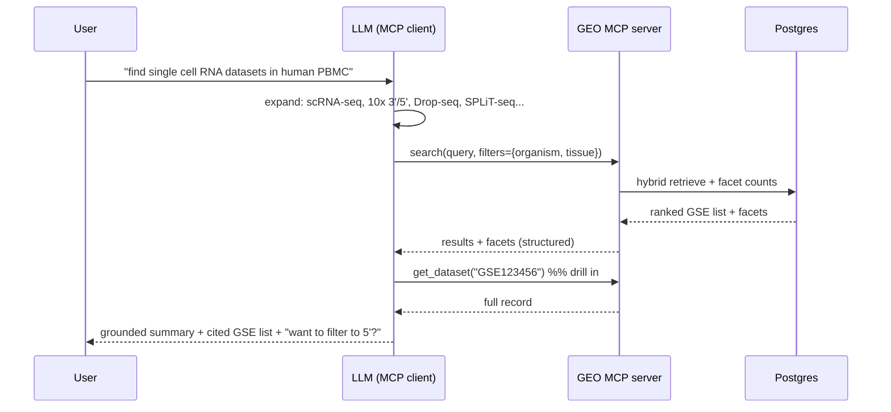

# 27 · MCP Interface

← [[Home]] · consumes [[23-Search-and-Retrieval]], [[24-Faceted-Search]]

> **Implementation tranche:** [[47-MCP-Server-Plan]] starts with
> `search_datasets`, `get_dataset`, and `facet_values` over local stdio.
> `expand_terms`, `resolve_ontology`, and non-GSE lookup wait for the tissue
> mapper and broader record indexing.

## Your question, answered

> *"I want a ranked list first, but I envision this being used over MCP with an LLM so the LLM can generate [the summary and conversation]. Is that reasonable and possible?"*

**Yes — and it's the better architecture.** You build a first-class **retrieval service** and expose it as MCP tools. The calling LLM (Claude, etc.) becomes the RAG orchestrator: it does query understanding + synonym expansion, calls your tools, reads the ranked list, and produces the summary (your "output #2") and the conversation (your "output #3"). You don't build, host, evaluate, or pay for a generation layer — the client brings its own.

## Why this split is right (not just convenient)

- **Faithful for discovery.** The primary artifact is the *ranked list of real GSEs* — inspectable, non-lossy, low hallucination. Collapsing a corpus to prose too early hides options the user needs to choose among.
- **Generation quality is the client's problem.** Summary faithfulness, citations, follow-ups — the frontier model already does these well, and improves without you shipping anything.
- **Clean contract.** Tools return structured data; the model composes. Same server works for a human UI, an agent, or a notebook.
- **Cheaper + simpler spike.** No LLM serving, no prompt-eval harness for generation on your side. You still own the part that's hard and defensible: **retrieval + normalization quality.**

## Proposed tools

| Tool | Input | Returns | Notes |
|---|---|---|---|
| `search_datasets` | `query`, `filters{}`, `expand?`, `limit` | ranked `[{gse, score, title, organism, assay, tissue, n_samples, year, snippet}]` + `facet_counts{}` | the workhorse; hybrid + facets in one call |
| `get_dataset` | `gse` | indexed GSE metadata, normalized fields, and GEO/PubMed links | drill-in; raw SOFT/GSM/SRA are not indexed yet |
| `facet_values` | `field`, `query?`, `prefix?` | `[{id, label, count}]` | populate/expand a facet; hierarchy-aware |
| `expand_terms` | `text` | `{ontology_terms:[…], synonyms:[…]}` | server-side ontology-grounded expansion (fallback if the client doesn't) |
| `resolve_ontology` | `text`, `field` | candidate `{id, label, confidence}` | exposes the [[22-Ontology-Normalization|normalization]] mapper |
| `lookup_accession` | `GSE/GSM/GPL` | record or cross-refs | exact fetch |

**Design guidance for tools:** return compact, structured, **token-efficient** payloads (IDs + labels + short snippets, not full SOFT); include `facet_counts` so the model can suggest refinements; always include the accession so answers are citable/verifiable.

### Strict enums, not free-text filters (the north star, operationalized)

Filters accept **controlled values**, not arbitrary raw strings. Organism and sex
use ontology IDs today; assay uses a closed set of category/detail labels until
EFO grounding is implemented. This is the mechanism behind
[[00-Overview#North star|"strict enums the LLM or human can query"]]:

- `facet_values` hands the caller the **valid vocabulary** for a field (IDs + labels + counts), so an LLM or a human UI **selects from a closed set** instead of guessing strings.
- The flow: the model resolves "human" → `NCBITaxon:9606` (via `resolve_ontology`/`facet_values`), then filters on the **ID**. No ambiguity, no silent empty results from a misspelled value.
- **Free text still works for the *semantic* part** (`query` → dense + expansion), but **facets are enums**. Semantic recall + enum precision, cleanly separated. → [[24-Faceted-Search]], [[22-Ontology-Normalization]]
- Bonus: because the vocabulary is closed and known, the server can *validate* filter inputs and return "did you mean…" candidates — making agent-issued queries reliable rather than best-effort.

## Query expansion: client or server?

Both, layered:
- **Client-side (primary):** the LLM naturally expands "single cell RNA" → the assay set. Best quality, no code.
- **Server-side (`expand_terms`, fallback):** ontology-grounded expansion for non-LLM callers and to keep behavior deterministic/testable. Ground in EFO/OBI to avoid drift. → [[23-Search-and-Retrieval#1. Query understanding]]

## Build notes

- Python **MCP SDK** (FastMCP-style); thin layer over the [[26-Datastore-Postgres|Postgres]] queries.
- Stateless tools; pagination via `offset`/cursor.
- Ship a tiny "instructions" blurb in the server so clients know to expand assay synonyms and to prefer `search_datasets` first.
- This is also the natural place to later add server-side reranking ([[23-Search-and-Retrieval#4. Reranking]]) transparently.

→ Milestone placement in [[40-Roadmap]].

## Sources

- Model Context Protocol (MCP) — https://modelcontextprotocol.io/
- Ranked list vs generated summary (retrieval vs RAG coverage) — https://arxiv.org/pdf/2603.08819
- Server-side reranking options (if added later) — https://futureagi.com/blog/best-rerankers-for-rag-2026/
