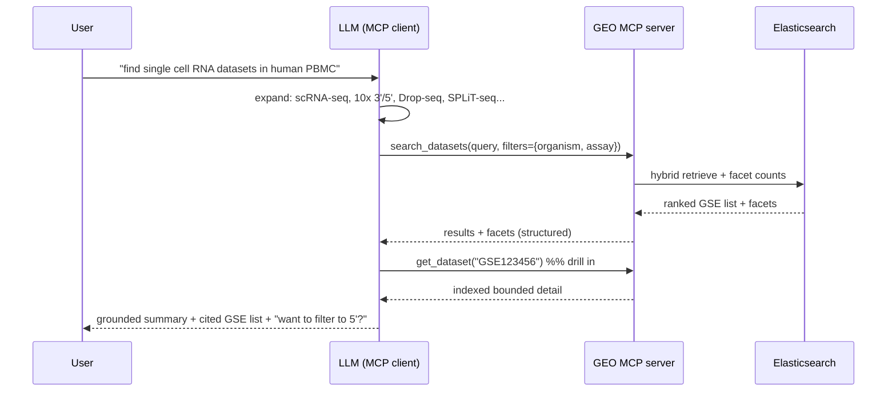

# 27 · MCP Interface

← [[Home]] · consumes [[23-Search-and-Retrieval]], [[24-Faceted-Search]]

> **Implemented 2026-07-13:** `main` contains the public hackathon FastMCP
> service with exactly `search_datasets`, `get_dataset`, and `facet_values` over
> stateless Streamable HTTP. It uses Elasticsearch and the deployment-selected
> query encoder; the primary default is `gemini_embedding_2_3072_v1`. Callers
> do not choose a retrieval mode. `expand_terms`, `resolve_ontology`, and
> non-GSE lookup remain deferred.

## Current implementation

| Responsibility | Implementation |
|---|---|
| Hosted settings | `src/geo_index/mcp_settings.py` composes fail-closed MCP and Elasticsearch environment settings; secrets are excluded from representations |
| Access | The hosted hackathon endpoint is public and anonymous; admission controls are global to its single worker |
| Wire contract | `src/geo_index/mcp_models.py` provides strict bounded Pydantic inputs and outputs |
| Search adapter | `src/geo_index/mcp_search_service.py` wraps `ElasticsearchSearchService`, validates index/facet readiness, hydrates ranked GSEs, and maps provenance |
| MCP/HTTP | `src/geo_index/mcp_server.py` registers the three tools, stateless `/mcp`, health/readiness routes, Host/Origin protection, request limits, rate/concurrency admission, and safe logging |
| Packaging | `Dockerfile`, `.dockerignore`, and `deploy/geo-mcp.env.example` package one Uvicorn worker without PostgreSQL MCP configuration |

The adapter performs no network or model I/O at Python import. Its lifespan
creates the official Elasticsearch client, validates `geo-series`, the mapping
revision, active vector field, and a complete bounded facet vocabulary, and
closes the query encoder/client on shutdown. Exact lookup and blank facet
browsing do not create a query encoder. Every nonblank public search lazily uses
the production hybrid strategy and one deployment-selected encoder; callers
cannot override either choice. Low-level modes remain available for evaluation.

Filter values remain OR-within/AND-across and are rejected before retrieval if
they are absent from the closed startup vocabulary. The vocabulary load fails
closed rather than silently truncating. Search outputs report mapping revision,
active model, vector field, and mode in `retrieval_version`.

### Verification evidence

- the offline repository and frontend suites cover strict schemas, shared
  search routing, HTTP admission, and browser integration;
- the live MCP smoke connected through `fastmcp.Client`, listed the exact three
  tools, created a **3,072-dimensional Gemini query embedding**, ran native
  Elasticsearch hybrid retrieval and facets, returned ranked GSEs, and fetched
  one result through `get_dataset`;
- the same smoke asserted `gemini_embedding_2_3072_v1` in MCP output provenance;
- HTTP tests cover anonymous stateless transport, strict schemas, Host/Origin
  rejection, body deadlines, rate/concurrency bounds, health/readiness, and
  sensitive-log redaction.

These checks cover the application and local live integration. Public deployment
operations are documented in `docs/deployment/digitalocean.md`.

## Hosted v1 access

The **(v1)** product surface is a standalone FastMCP 3 ASGI service at `/mcp`.
FastMCP recommends Streamable HTTP for centralized, multi-client network
deployments and exposes an ASGI app through `http_app()`
([running servers](https://gofastmcp.com/deployment/running-server),
[HTTP deployment](https://gofastmcp.com/deployment/http)).

The hackathon endpoint is public and anonymous at
`https://geoscope.kevinformatics.com/mcp`. Clients discover the tool schemas
through MCP `tools/list`. A process-wide token bucket, concurrency bound, body
limit, Host/Origin protection, and masked errors provide coarse demo safety;
identity-based quotas and multi-tenant administration remain **(v2+)**.

## Your question, answered

> *"I want a ranked list first, but I envision this being used over MCP with an LLM so the LLM can generate [the summary and conversation]. Is that reasonable and possible?"*

**Yes — and it's the better architecture.** You build a first-class **retrieval service** and expose it as MCP tools. The calling LLM (Claude, etc.) becomes the RAG orchestrator: it does query understanding + synonym expansion, calls your tools, reads the ranked list, and produces the summary (your "output #2") and the conversation (your "output #3"). You don't build, host, evaluate, or pay for a generation layer — the client brings its own.

## Why this split is right (not just convenient)

- **Faithful for discovery.** The primary artifact is the *ranked list of real GSEs* — inspectable, non-lossy, low hallucination. Collapsing a corpus to prose too early hides options the user needs to choose among.
- **Generation quality is the client's problem.** Summary faithfulness, citations, follow-ups — the frontier model already does these well, and improves without you shipping anything.
- **Clean contract.** Tools return structured data; the model composes. Same server works for a human UI, an agent, or a notebook.
- **Cheaper + simpler spike.** No LLM serving, no prompt-eval harness for generation on your side. You still own the part that's hard and defensible: **retrieval + normalization quality.**

## v1 tools

| Tool | Input | Returns | Notes |
|---|---|---|---|
| `search_datasets` | `query`, `filters{}`, `limit` | `{query, filters, limit, retrieval_version, embedding_variant, results:[...], facets:{...}}` | always uses the production hybrid strategy |
| `get_dataset` | `gse` | `{found, dataset}` with bounded indexed metadata and GEO/PubMed links | drill-in; raw SOFT/GSM/SRA are not indexed yet |
| `facet_values` | `field`, `query?`, `filters?`, `limit?` | `{field, buckets:[{value,label,count}], scope, candidate_count, retrieval_version, embedding_variant}` | hybrid when query-scoped; filter-only when blank |

### Deferred tools **(v2+)**

These are design options, not part of the hosted v1 tool list:

| Tool | Input | Returns | Dependency |
|---|---|---|---|
| `expand_terms` | `text` | `{ontology_terms:[…], synonyms:[…]}` | server-side ontology-grounded expansion (fallback if the client doesn't) |
| `resolve_ontology` | `text`, `field` | candidate `{id, label, confidence}` | exposes the [[22-Ontology-Normalization|normalization]] mapper |
| `lookup_accession` | `GSE/GSM/GPL` | record or cross-refs | exact fetch |

**Design guidance for tools:** return compact, structured, **token-efficient** payloads (IDs + labels + short snippets, not full SOFT); include `facets` so the model can suggest refinements; always include the accession so answers are citable/verifiable.

### Strict enums, not free-text filters (the north star, operationalized)

Filters accept **controlled values**, not arbitrary raw strings. Organism and sex
use ontology IDs today; assay uses a closed set of category/detail labels until
EFO grounding is implemented. This is the mechanism behind
[[00-Overview#North star|"strict enums the LLM or human can query"]]:

- `facet_values` hands the caller the **valid vocabulary** for a field (IDs + labels + counts), so an LLM or a human UI **selects from a closed set** instead of guessing strings.
- The v1 flow: the model maps "human" to `NCBITaxon:9606` from its own
  knowledge or `facet_values`, then filters on the **ID**. The deferred
  `resolve_ontology` tool can make that grounding server-owned later.
- **Free text still works for the *semantic* part** (`query` → dense + expansion), but **facets are enums**. Semantic recall + enum precision, cleanly separated. → [[24-Faceted-Search]], [[22-Ontology-Normalization]]
- Bonus: because the vocabulary is closed and known, the server can *validate* filter inputs and return "did you mean…" candidates — making agent-issued queries reliable rather than best-effort.

## Query expansion: client or server?

Both are possible, but only the first is **(v1)**:
- **Client-side (primary):** the LLM naturally expands "single cell RNA" → the assay set. Best quality, no code.
- **Server-side (`expand_terms`, fallback, v2+):** ontology-grounded expansion
  for non-LLM callers and deterministic behavior after the tissue mapper has a
  stable contract. → [[23-Search-and-Retrieval#1. Query understanding]]

## Build notes

- Standalone **FastMCP 3** in `src/geo_index/mcp_server.py`; its typed
  `McpSearchService` adapter uses the primary Elasticsearch `geo-series` index
  for exact, BM25, dense, hybrid, filter, and facet retrieval.
- Streamable HTTP with stateless transport, one public anonymous application
  worker, TLS at the hosting edge, and bounded global request admission.
- Read-only tools with bounded result counts; pagination remains **(v2+)**.
- Ship a tiny "instructions" blurb in the server so clients know to expand assay synonyms and to prefer `search_datasets` first.
- This is also the natural place to later add server-side reranking ([[23-Search-and-Retrieval#4. Reranking]]) transparently.
- The active embedding variant is server configuration and appears only as
  output provenance; callers cannot select a model. →
  [[48-Alternate-Embedding-Bakeoff]]
- The current default is `gemini_embedding_2_3072_v1`; public nonblank searches
  create its query encoder lazily, while blank facet browsing and exact lookup
  remain provider-free.
- The reviewed implementation design and executable plan are
  `docs/superpowers/specs/2026-07-12-elasticsearch-mcp-migration-design.md` and
  `docs/superpowers/plans/2026-07-12-elasticsearch-mcp-migration.md`.

→ Milestone placement in [[40-Roadmap]].

## Sources

- Model Context Protocol (MCP) — https://modelcontextprotocol.io/
- FastMCP running/Streamable HTTP — https://gofastmcp.com/deployment/running-server
- FastMCP HTTP/ASGI deployment — https://gofastmcp.com/deployment/http
- Ranked list vs generated summary (retrieval vs RAG coverage) — https://arxiv.org/pdf/2603.08819
- Server-side reranking options (if added later) — https://futureagi.com/blog/best-rerankers-for-rag-2026/
